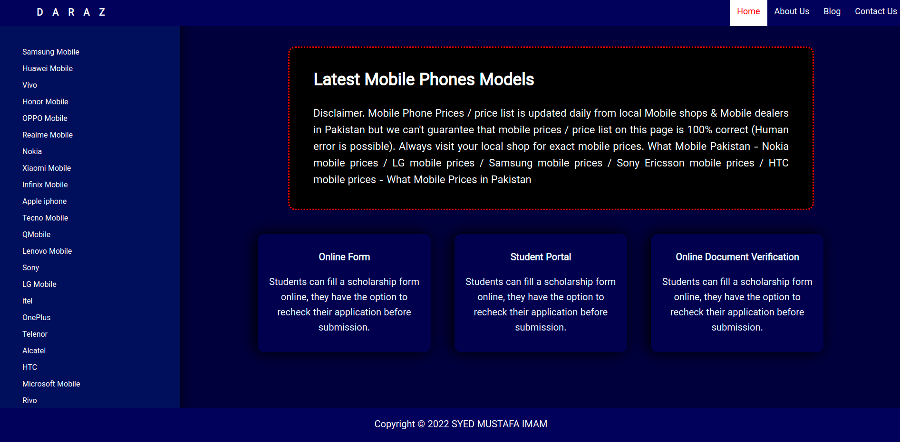

# HTML/CSS Crash Course 

## Lecture 3

In lecture 3 all the concepts of __HTML__ and __CSS__ which ware taught previously were applied and implemented. 

#### During the lecture we have created this webpage.

 
 

We have also covered Bootstrap and its:

- Layout
- Grids
- Components
- Forms 

Lecture recording: 