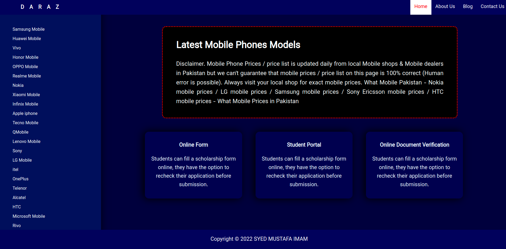

# HTML/CSS Crash Course 

## Lecture 1
The topics that we have covered in first lecture:

- HTML Overview
- Basic Tags
- Elements
- Attributes
- Formating
- Meta tags
- Comments
- Images
- Links
- Ordered List
- Unordered List
- Description List
- Blocks
- Tables
- Creating layout using tables

Lecture recording: https://www.youtube.com/watch?v=Alg5ZnZgqiw

## Lecture 2
#### HTML
- Tables
- Creating layout using tables
- Forms
- Radio Button
- Checkbox
- Label, Fieldset and legends
- Select Option

#### CSS TOPICS
- Overview
- Inclusion
  -  Selector
  -  Classes
  -  Ids
- Syntax
- Measurments Units 
- Colors
- Background
- Fonts
- Text
- Images
- Tables
- Borders
- Margins
- Paddings
- Dimension
- Postioning

Lecture recording: https://www.youtube.com/watch?v=Sttenpo2-O8

## Lecture 3

In lecture 3 all the concepts of __HTML__ and __CSS__ which were taught previously are applied and implemented. 

#### During the lecture we have created this webpage.

 
 

We have also covered Bootstrap and its:

- Layout
- Grids
- Components
- Forms 

Lecture recording: https://www.youtube.com/watch?v=y9yRXp2IENk
